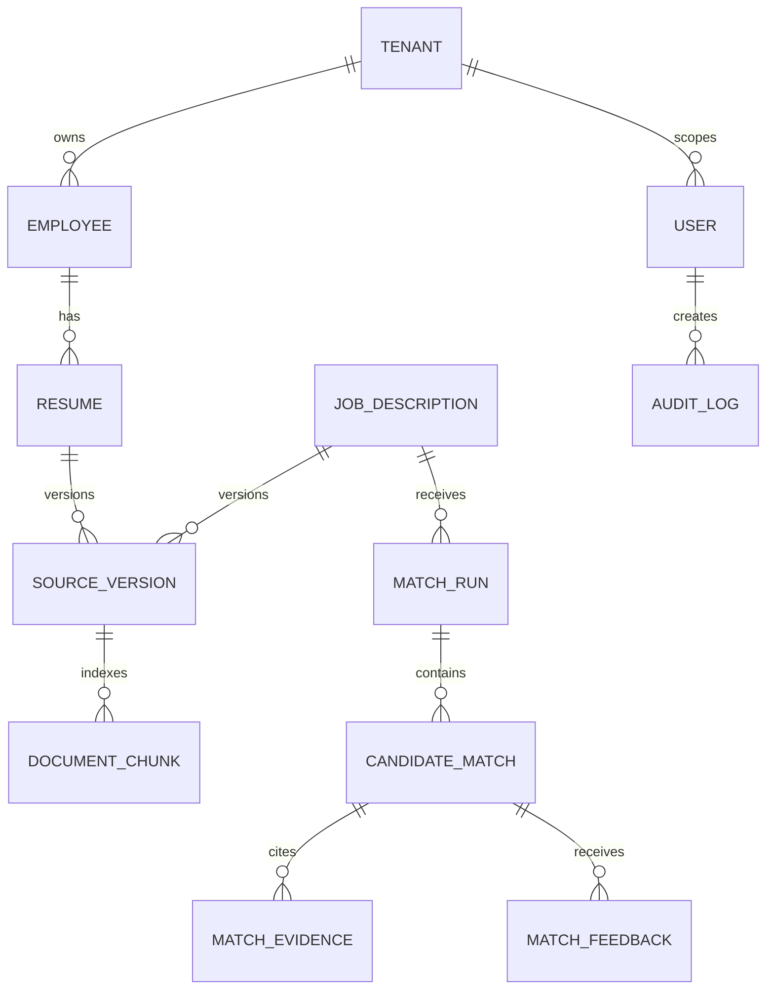

# Entity relationship and lifecycle notes

All tenant-owned operational records carry `tenant_id`. Readiness and active-version state are application fields used to exclude drafts, failed versions, archived resumes, and stale vectors from retrieval. Database migrations in `backend/alembic/versions` are the schema source of truth; `backend/app/models/models.py` mirrors the tables and indexes. Vector records retain document IDs and source offsets for evidence lineage.
