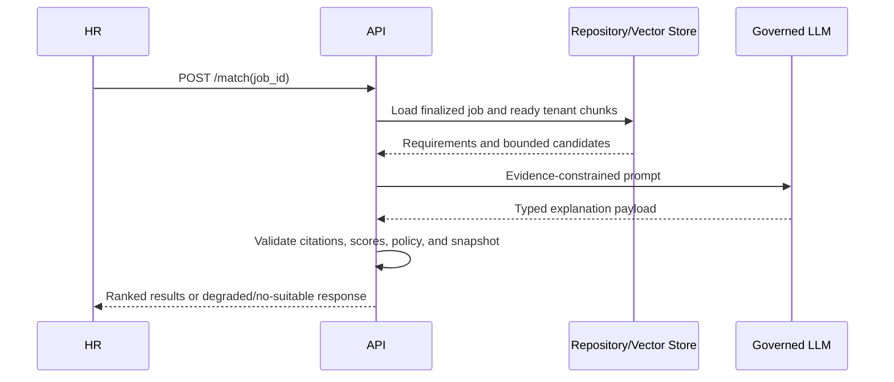

```mermaid
sequenceDiagram
  participant HR
  participant API
  participant Store as Repository/Vector Store
  participant Model as Governed LLM
  HR->>API: POST /match(job_id)
  API->>Store: Load finalized job and ready tenant chunks
  Store-->>API: Requirements and bounded candidates
  API->>Model: Evidence-constrained prompt
  Model-->>API: Typed explanation payload
  API->>API: Validate citations, scores, policy, and snapshot
  API-->>HR: Ranked results or degraded/no-suitable response
```

Protected attributes are excluded before retrieval. Every displayed material signal must point to a source chunk; unsupported model claims are flagged as degraded.
